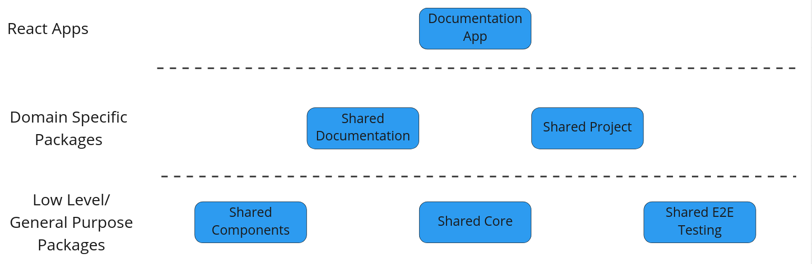

# LCA Collect - Shared Core Library

A shared library for core functionality, utilities and pages.



## Getting Started

1. Generate a Personal Access Token (PAT) with _Packaging (Read & write)_ scope on [Azure Devops](https://dev.azure.com/arkitema/_usersSettings/tokens)
2. Connect to [the Azure Artifacts _frontend-packages_ feed](https://dev.azure.com/arkitema/lca-platform/_artifacts/feed/frontend-packages/connect/npm) - click on 🖥**Other** and follow the instructions

## Build, Test & Publish

Testing is done with [Vitest](https://vitest.dev/)

```shell
npm run test
```

To publish a new version:

1. Update the version in `package.json` (remember to follow semver)
2. When you're satisfied and ready to publish, then create a PR

## Development Setup with other @lcacollect packages

You can use `npm link` to set up live reloading of the other `@lcacollect` packages.

- Clone the package that you wish to enable live reload on.
- In the terminal, go the root folder of the cloned repo and write `npm link` in the terminal
- Go back to this repo's root folder and write `npm link @lcacollect/{PACKAGE}` to link the package.
- When you make changes to the package, that you wish to see in this app, simply run `npm run build` in the package and
  the changes will available here.

## Folder Structure and Naming
```python
src/ # Contains the source code
    __mocks__/ # Contains the mock data and functions for unit tests
    pages/ # Page components
    util/ # Contains varius helper functions
```

## Further Documentation

Further documentation for LCAcollect can be found [here](https://github.com/lcacollect/.github/blob/main/wiki/README.md)
